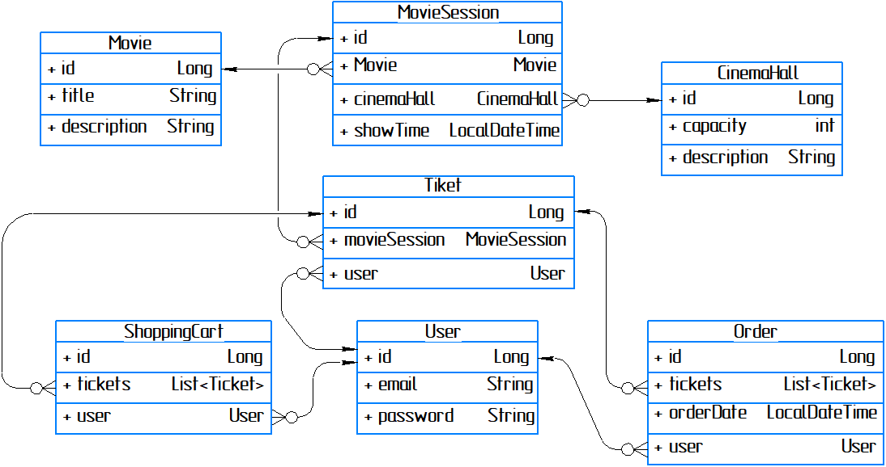

# cinemania

<h3>Project descriptions:</h3>
Here's a simple, however, smart app which can imitate some serious project responded on ticket 
distribution. The idea is to bind some different classes (or entities in our cases) and demonstrate 
how it can be getting on together, interacting with DB and managed by spring.  The main feature of 
this APP is to delegate roles, in other words who will be responsible for what. Security Spring 
concept was implemented to resolve this task. Strictly speaking, admin and users will have their 
own interface for managing and resolve their tasks.

<h3>All features:</h3>
- storing information about users, order's history, available tickets or cinema halls 
- authentication option supported 
- authorization option supported by spring security 
- flexible interface: you may add new entities from all available classes as much as you like 
- ability to use real schedule because we apply LocalDateTime 
- flexible exception report on front end if such necessity arise (implemented by ResponseEntityExceptionHandler) 
- protection against the fool while try to send invalid data (God bless javax.validation.constraints) 

<h3>In this APP were used such technologies like:</h3>
- java, version 11 
- org.apache.maven, version 3.8.0 
- org.hibernate - 5.6.10.Final 
- spring version 5.3.22 
- spring security version 5.5.0 
- jdbc (mysql-connector-java version 8.0.29) 
- javax.annotation 
- three-tier architecture 
- checkstyle.plugin.version - 3.1.1 
- HQL

<h3>DataBase structure:</h3>

<h3>Instructions for assembling and running the application:</h3>
- To build the application, you need to install JDK and Maven 
- For the full functioning of java applications, you must specify the path to each of the installed
  components to the system. For Windows: The Path system variable must contain the path to the Java and
  Maven programs (to the bin folders). 
- MySQL - must have installed (workbench will come in handy). 
- While creating a connection to mySQL, configure port (3307 by default) and fetch password in db.properties. 
- Tomcat up to 10 version - must have! 
- Launching can be done using the IDE. All requests by browser or Postman. 
- Here's basic endpoints to ease your life at the beginning: 
  FOR ADMIN: 
  POST: /cinema-halls 
  POST: /cinema-halls 
  POST: /movies 
  POST: /movie-sessions 
  PUT: /movie-sessions/{id} 
  DELETE: /movie-sessions/{id} 
  GET: /users/by-email 

  FOR USERS: 
  GET: /orders 
  POST: /orders/complete 
  PUT: /shopping-carts/movie-sessions 
  GET: /shopping-carts/by-user 

  FOR BOTH ROLES: 
  GET: /cinema-halls 
  GET: /movies 
  GET: /movie-sessions/available 
  
  FOR NON AUTHENTICATED CUSTOMERS: 
  POST: /register 
